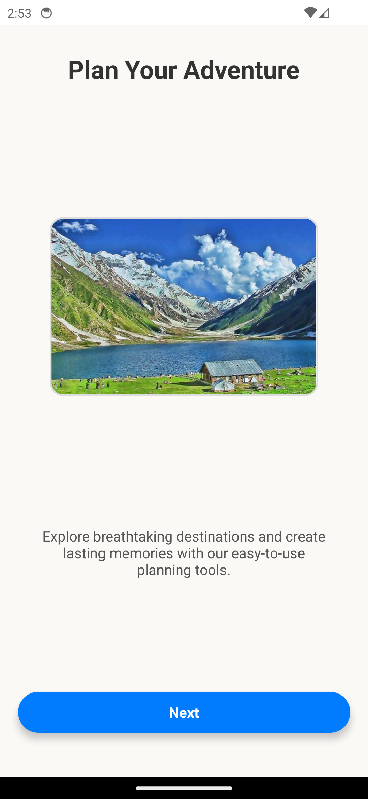
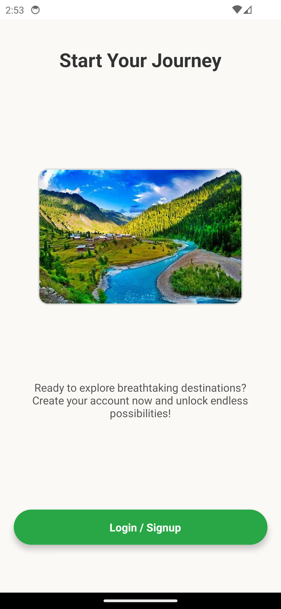

# Onboarding Login App

Welcome to the **Onboarding Login App**! This app provides a simple user interface for logging in, signing up, and navigating through onboarding screens. The app is designed to be intuitive and user-friendly, offering a seamless experience for users to get started with the application.

---

## Screenshots

### 1. **Onboarding Screen 1**
This onboarding screen explains the app's core features and guides users on how to get started.


---

### 2. **Onboarding Screen 2**
This screen provides additional information about the app’s functionality and how it will benefit the user.



---

### 3. **Onboarding Screen 3**
The final onboarding screen offers the option to skip onboarding or proceed to the main screen.



---

### 4. **Login Screen**
The login screen allows users to input their email and password to access their account. If they don't have an account, there's a link to the signup screen.


---

### 5. **Signup Screen**
This screen enables users to create a new account by providing their username, email, password, and confirming their password. Once they fill out the required fields, they can submit their details to sign up.


---

## Features

- **Onboarding Process**: A set of onboarding screens to introduce the app's features and guide new users.
- **Login & Signup**: Allows users to securely log in or sign up for an account.
- **Responsive Design**: The app is fully responsive and works seamlessly across various devices.

---

## Installation

To run this app on your local machine, follow these steps:

1. **Clone the repository**:
   ```bash
   git clone https://github.com/HassanMohtashim/OnboardingLoginApp-React-Native-using-Expo
